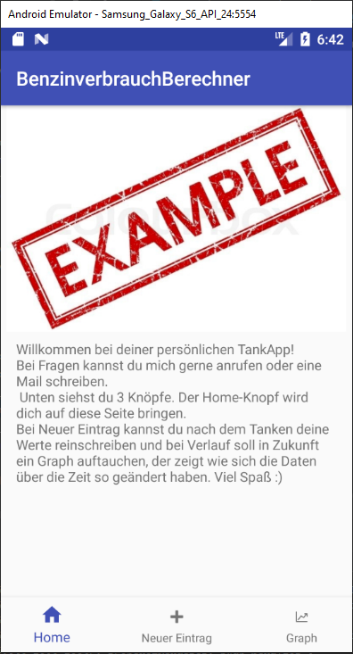
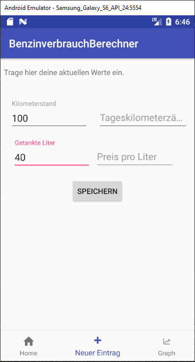
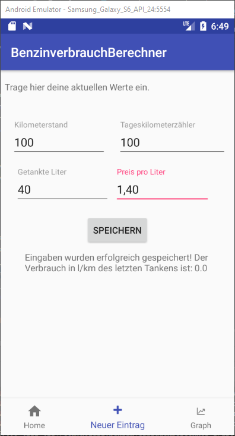
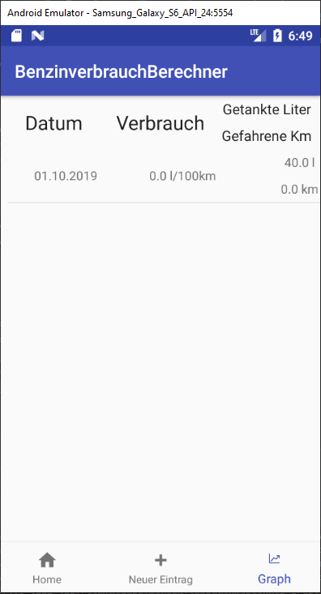

# FuelConsumptionCalculator
This is an Android app to calculate your car's fuel consumption after refueling. I was requested to make this by someone who doesn't speak english very well, so most of it is german. Furthermore they aren't "tech savvy", which means I had to explain a bit more than usual on the app's main screen.

As said above this app is to calculate fuel consumption, not much else. 

This is a project intended for private use by some selected persons. It has not been optimized to be used by other people. 

## Requirements and setup
* Java 7 or higher
* Android 7.0 Nougat or higher
* Replace mipmap-hdpi/nyd.jpg and nyd_resize.jpg with pictures that you'd like to see on the app's home screen

## Usage
When starting the app you're greated with the Homescreen. This will give people without much smartphone-knowledge a little guide on what to do.

Entering a new set of data will look something like this:

After saving this data, the app will calculate (based on the newly given data and the youngest data from the database) your fuelconsumption. 0.0 l/km if it's the first entry.

Finally under "graph" - there is no graph, yet. Just a list of all the data.

## Known Problems
Clicking on an entry in the list of refueling data will only show raw data. There is no UI for that yet.

## Future Plans 
* Building the UI for displaying the data of a refueling entry, when clicked on in the list
* Making the data easier to read by displaying it in a graph
* UI improvements
